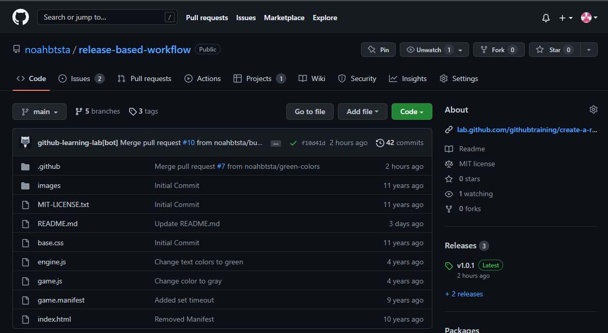

# Lab 9

This lab was a free course on Github on creating a release based workflow. This allows for 
teams to build, test, and delegate work tasks in a smooth and organized manner. 

### Skills Used in Project
- Creating new repository
- Cloning repository
- Editing and organizing the readME.md file 
- Accepting new pull requests
- Merging banches, and detecting changes within them
- Navigating through the Github interface
- Following steps within Github course

